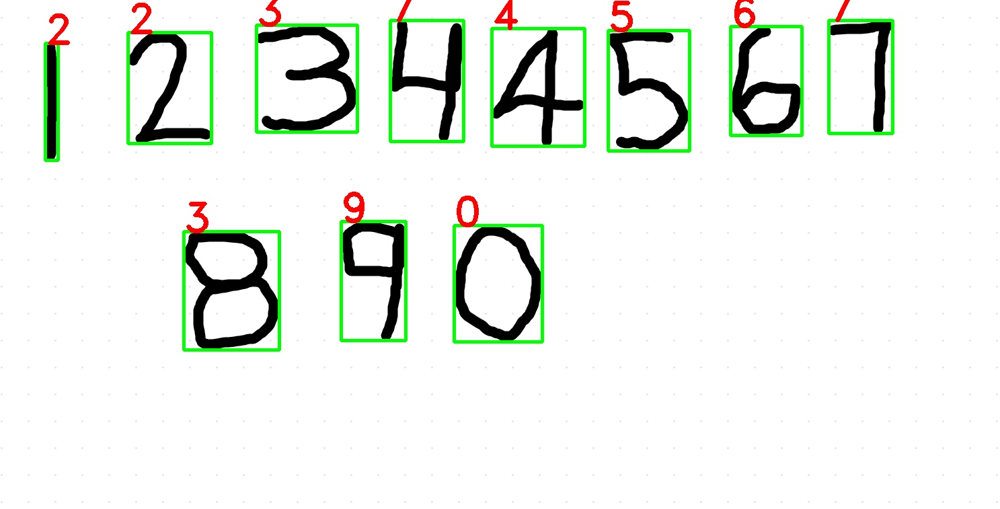
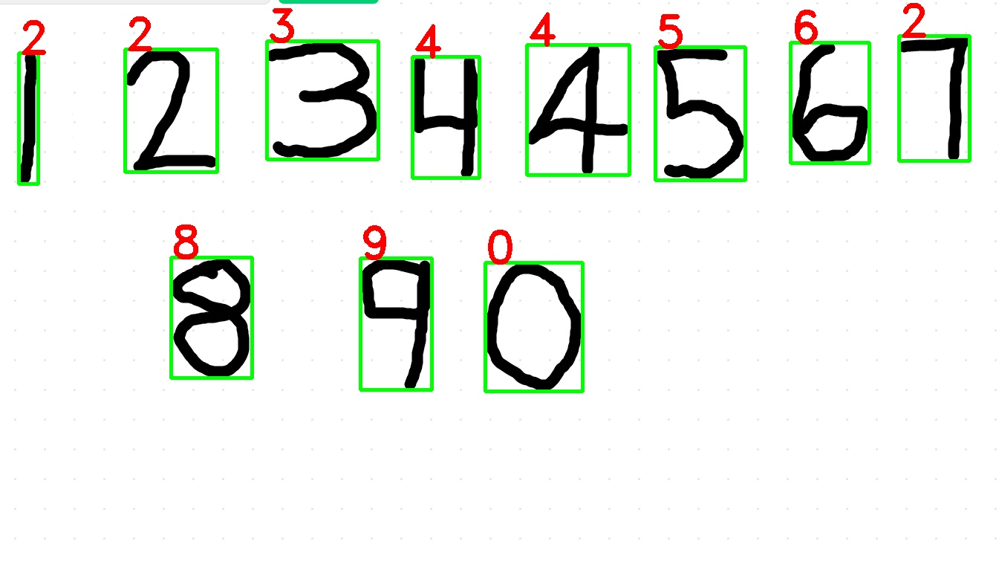
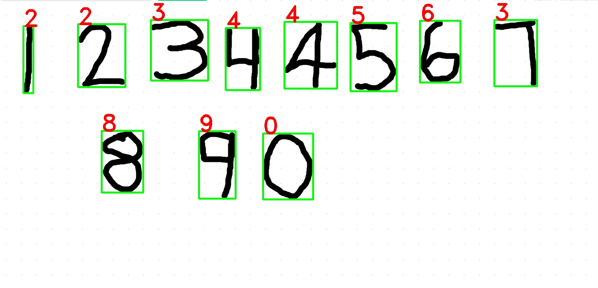
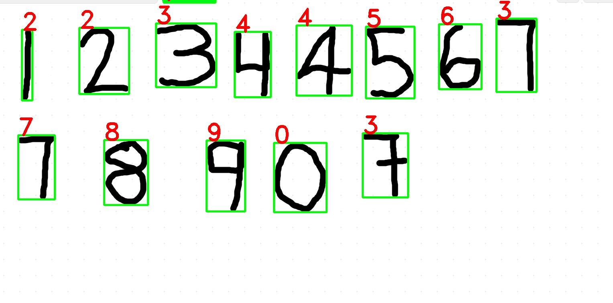

# Handwritten Digit Detection Using Python, OpenCV, and TensorFlow-Keras

This project detects handwritten digits using Python, OpenCV, and TensorFlow-Keras. It supports both real-time video input and image-based input.

## Accuracy

- **Accuracy:** 97.3%

## Features

- Real-time digit detection using video input.
- Image-based digit detection for testing with predefined images.
- Detailed results saved in separate folders for easy access.
- Includes videos and images for testing the model.

## Project Structure

- **Video Folder**: Contains video files for real-time testing.
- **Image Folder**: Contains image files for testing.
- **ResultImage Folder**: Stores the output results of image-based tests.
- **ResultVideo Folder**: Stores the output results of video-based tests.
- **realTimedetection.py**: Script for real-time video input digit detection.
- **testscript.py**: Script for image-based digit detection.

## Requirements

- Python 3.x
- OpenCV
- TensorFlow (Keras)
- NumPy

You can install the required dependencies using:

```bash
pip install -r requirements.txt

<b>Result Image</b>





